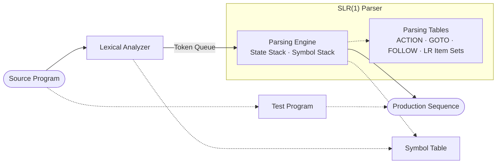

# Compiler Front-End Coursework

> [!IMPORTANT]
> This repository contains coursework completed in 2021 for a compiler-principles course.
> It is preserved for educational reference, not production use; compatibility with current Python versions and dependencies is not maintained.

[中文说明](README.zh-CN.md)

## Architecture



## Overview

This project implements the early front-end stages of a compiler in Python:

- a **YAML-configured lexical analyzer**;
- **FIRST and FOLLOW set** computation;
- **LR item-set** construction;
- **SLR(1) ACTION and GOTO table** generation;
- **shift-reduce parsing** with panic-mode error recovery;
- a **multiprocessing pipeline** between the lexer and parser.

The example grammar recognizes a C-like language and covers lexical analysis, parsing-table construction, SLR parsing, and basic error reporting.

## Project Structure

```
lexical_analysis/       Lexer: YAML state definitions, input handling, state machine
syntax_analysis/        SLR(1) table generation and parser implementation
test/                   Test input and manual lexer test script
main.py                 Integrated lexer-parser pipeline entry point
utils.py                Token definitions, grammar enumeration, output formatting
```

## Running the Example

**Requirements**:

- Python 3
- [PyYAML](https://pypi.org/project/PyYAML/)
- [pandas](https://pypi.org/project/pandas/)

```bash
pip install -r requirements.txt
python main.py
```

The example input is at `test/test_lexical_input.txt`. The program prints FIRST and FOLLOW sets, LR item sets, parsing tables, any lexical or syntax errors, and the applied production sequence.

## Lexical Analyzer Design

The lexer builds a state-transition graph from YAML, consumes the input character by character, and emits tokens.

### Configuration

State diagram:


Corresponding YAML excerpt:

```yaml
states:
  - num: 0
    edges:
      space: 0
      letter: 1

  - num: 1
    edges:
      letter: 1
      digit: 1
      other: 2

  - num: 2
    final: true
    rollback: true
    token: (CATEGORY_DICT[token], token) if token in CATEGORY_DICT else (IDENTIFIER, token)
```

### State Transition Graph

The demo uses this lexical specification:


Nodes with identical actions are merged in the final graph:


### Example

`test/test_lexical_analyzer.py` exercises the lexer independently against `test/test_lexical_input.txt`.

**Input:**
```c
int main() {
    1EC
    int a;
    a a;
    a = 10;
    t;
    if(a == 10) {
        char c;
        c = 'a';
        printf("Hello World!%c", c);
    }
    while(a>=10) {
        printf("Hello World!%c", c);
    }
}
```

**Output:**
```
(116, 'int') (1, 'main') (25, '(') (26, ')') (29, '{') (0, '1EC') (116, 'int') (1, 'a') (4, ';') (1, 'a') (1, 'a') (4, ';') (1, 'a') (16, '=') (2, 10.0) (4, ';') (1, 't') (4, ';') (115, 'if') (25, '(') (1, 'a') (15, '==') (2, 10.0) (26, ')') (29, '{') (103, 'char') (1, 'c') (4, ';') (1, 'c') (16, '=') (5, 'a') (4, ';') (1, 'printf') (25, '(') (6, 'Hello World!%c') (24, ',') (1, 'c') (26, ')') (4, ';') (30, '}') (131, 'while') (25, '(') (1, 'a') (13, '>=') (2, 10.0) (26, ')') (29, '{') (1, 'printf') (25, '(') (6, 'Hello World!%c') (24, ',') (1, 'c') (26, ')') (4, ';') (30, '}') (30, '}')
```

## SLR(1) Parser Design

The parser computes LR(0) item sets and SLR(1) ACTION/GOTO tables, then performs shift-reduce parsing with panic-mode error recovery.

### Grammar

The demo recognizes a C subset defined by the following productions:

```
PROG_BLOCK      → FUNC_DEF | VAR_DECLARE ; | PROG_BLOCK PROG_BLOCK
FUNC_DEF        → TYPE id ( FORMAL_PARAM ) { FUNC_BLOCK }
                | TYPE id ( ) { FUNC_BLOCK }
VAR_DECLARE     → TYPE id
FORMAL_PARAM    → TYPE id | TYPE id , FORMAL_PARAM
FUNC_BLOCK      → VAR_DECLARE ; | VAR_ASSIGN ; | FUNC_CALL ;
                | LOOP | BRANCH | FUNC_BLOCK FUNC_BLOCK
VAR_ASSIGN      → id = CONSTANT
CONSTANT        → VALUE_EXPRESSION | BOOL_EXPRESSION
                | integer | real | char | string
VALUE_EXPRESSION→ VALUE_EXPRESSION ARITH_OPT VALUE_EXPRESSION
                | - VALUE_EXPRESSION | FUNC_CALL
                | ( VALUE_EXPRESSION ) | id | integer | real
BOOL_EXPRESSION → VALUE_EXPRESSION CMP_OPT VALUE_EXPRESSION
                | BOOL_EXPRESSION && BOOL_EXPRESSION
                | BOOL_EXPRESSION || BOOL_EXPRESSION
                | ! BOOL_EXPRESSION | FUNC_CALL
                | ( BOOL_EXPRESSION ) | id | true | false
FUNC_CALL       → id ( REAL_PARAM ) | id ( )
REAL_PARAM      → id | CONSTANT | REAL_PARAM , REAL_PARAM
LOOP            → while ( BOOL_EXPRESSION ) { FUNC_BLOCK }
BRANCH          → if ( BOOL_EXPRESSION ) { FUNC_BLOCK }
                | if ( BOOL_EXPRESSION ) { FUNC_BLOCK } else { FUNC_BLOCK }
TYPE            → int | char | string | float
ARITH_OPT       → + | - | * | / | %
CMP_OPT         → > | < | == | >= | <= | !=
```

### Example

Run `main.py` to exercise the lexer-parser pipeline. A shortened output excerpt:

```text
[ERROR] Lexical error detected: unable to recognize token 1EC

GrammarVarEnum.TYPE→int
GrammarVarEnum.VAR_DECLARE→TYPE a
GrammarVarEnum.FUNC_BLOCK→VAR_DECLARE ;
[ERROR] Syntax error detected: state 51 has no action for input symbol "a" at position 10:
closure(51):
item_list: [GrammarVarEnum.VAR_ASSIGN→id • = CONSTANT , GrammarVarEnum.FUNC_CALL→id • ( REAL_PARAM ) , GrammarVarEnum.FUNC_CALL→id • ( ) ]
go_list: {'=': 52, '(': 53}
Running recovery routine...

GrammarVarEnum.VALUE_EXPRESSION→10.0
GrammarVarEnum.CONSTANT→VALUE_EXPRESSION
GrammarVarEnum.VAR_ASSIGN→a = CONSTANT
GrammarVarEnum.FUNC_DEF→# TYPE main FUNC_BLOCK }
GrammarVarEnum.PROG_BLOCK→FUNC_DEF
Analysis complete!
```

## Notes & Academic Integrity

The lexer evaluates expressions embedded in its YAML configuration. Treat the bundled configuration as
 trusted input; do not use the lexer with untrusted YAML files.

This project is coursework provided for educational reference. Please do not submit it, or substantial
 parts of it, as your own work.

## License

See [LICENSE](LICENSE).
